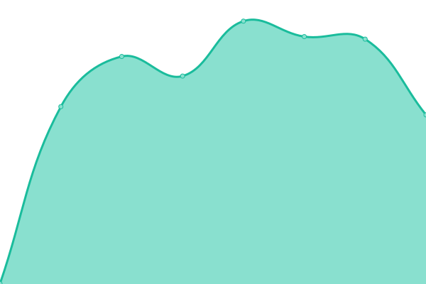
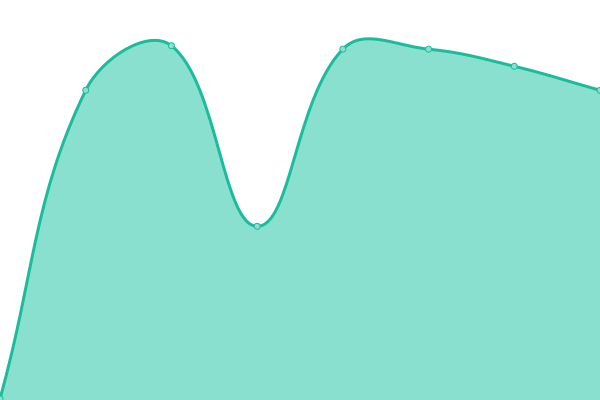
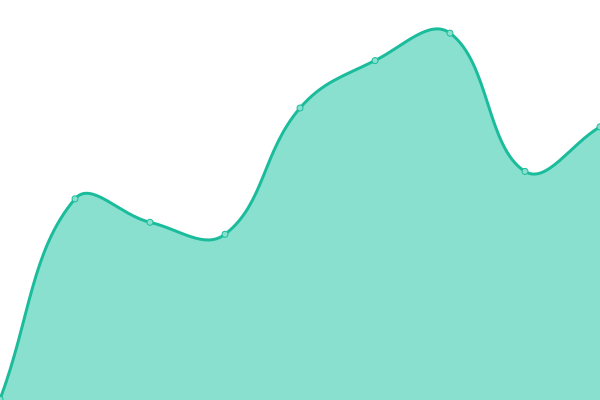

# [📈 Live Status](https://status.youngmin.kr): <!--live status--> **🟧 Partial outage**

This repository contains the open-source uptime monitor and status page for [Youngmin Lee](https://dev.youngmin.kr), powered by [Upptime](https://github.com/upptime/upptime).

With [Upptime](https://upptime.js.org), you can get your own unlimited and free uptime monitor and status page, powered entirely by a GitHub repository. We use [Issues](https://github.com/LYNGMN/status/issues) as incident reports, [Actions](https://github.com/LYNGMN/status/actions) as uptime monitors, and [Pages](https://status.youngmin.kr) for the status page.

<!--start: status pages-->
<!-- This summary is generated by Upptime (https://github.com/upptime/upptime) -->
<!-- Do not edit this manually, your changes will be overwritten -->
<!-- prettier-ignore -->
| URL | Status | History | Response Time | Uptime |
| --- | ------ | ------- | ------------- | ------ |
|  [update.youngmin.kr](https://update.youngmin.kr/) | 🟩 Up | [update-youngmin-kr.yml](https://github.com/LYNGMN/status/commits/HEAD/history/update-youngmin-kr.yml) | 

 733ms
     
 | 

<a href="https://status.youngmin.kr/history/update-youngmin-kr">100.00%</a>
    

|  [brand.youngmin.kr](https://brand.youngmin.kr/) | 🟩 Up | [brand-youngmin-kr.yml](https://github.com/LYNGMN/status/commits/HEAD/history/brand-youngmin-kr.yml) | 

 270ms
     
 | 

<a href="https://status.youngmin.kr/history/brand-youngmin-kr">100.00%</a>
    

|  [gallery.youngmin.kr](https://gallery.youngmin.kr/) | 🟩 Up | [gallery-youngmin-kr.yml](https://github.com/LYNGMN/status/commits/HEAD/history/gallery-youngmin-kr.yml) | 

 361ms
     
 | 

<a href="https://status.youngmin.kr/history/gallery-youngmin-kr">100.00%</a>
    

|  [go.youngmin.kr](https://go.youngmin.kr/) | 🟥 Down | [go-youngmin-kr.yml](https://github.com/LYNGMN/status/commits/HEAD/history/go-youngmin-kr.yml) | 

 359ms
     
 | 

<a href="https://status.youngmin.kr/history/go-youngmin-kr">99.22%</a>
    

|  [share.youngmin.kr](https://share.youngmin.kr/) | 🟥 Down | [share-youngmin-kr.yml](https://github.com/LYNGMN/status/commits/HEAD/history/share-youngmin-kr.yml) | 

 309ms
     
 | 

<a href="https://status.youngmin.kr/history/share-youngmin-kr">99.24%</a>
    

<!--end: status pages-->

[**Visit our status website →**](https://status.youngmin.kr)

## 📄 License

- Powered by: [Upptime](https://github.com/upptime/upptime)
- Code: [MIT](./LICENSE) © [Youngmin Lee](https://dev.youngmin.kr)
- Data in the `./history` directory: [Open Database License](https://opendatacommons.org/licenses/odbl/1-0/)
